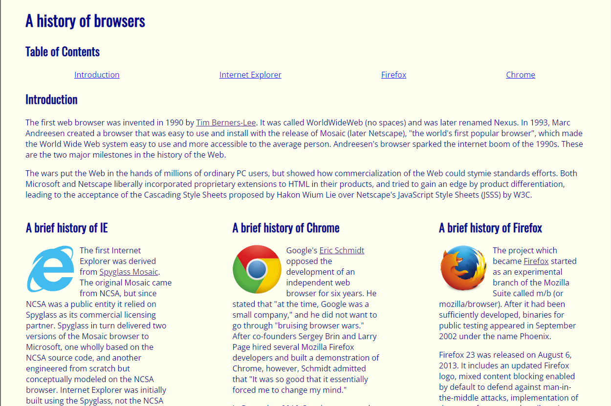
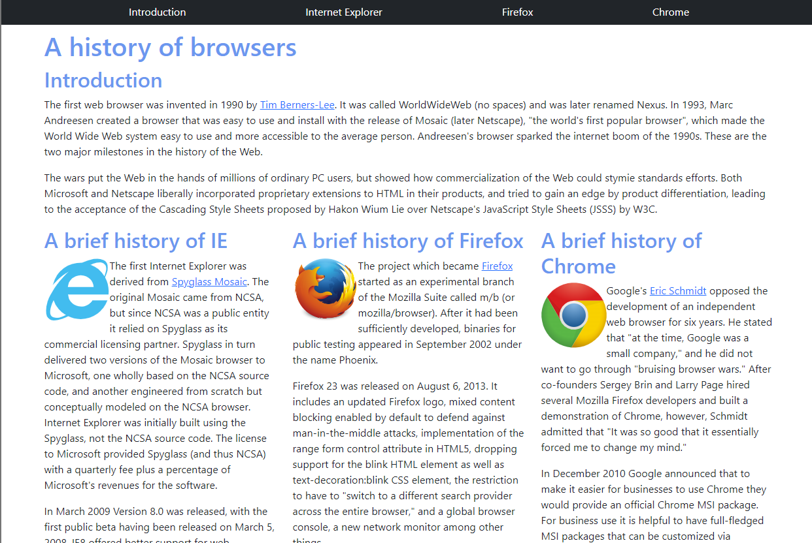
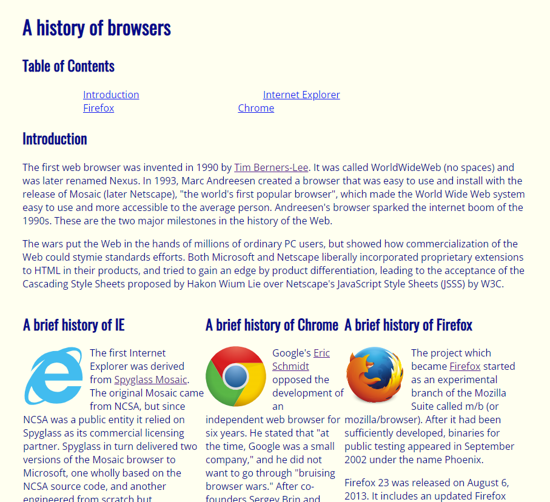
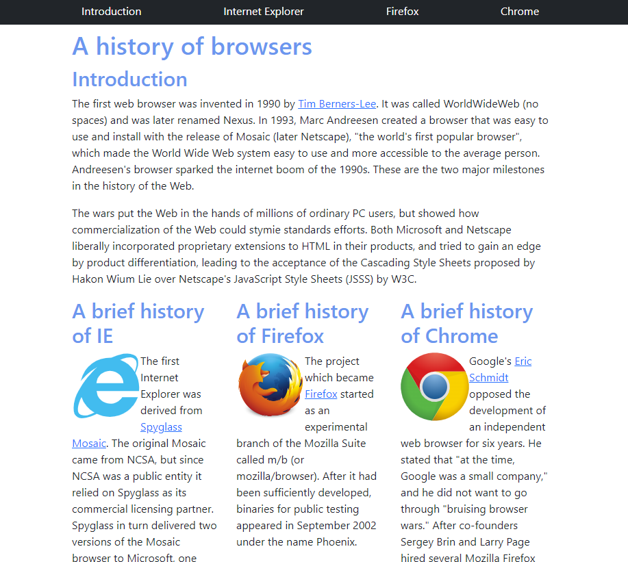

*Building nice-looking website with purely HTML and CSS can be challenging, so try with UI Framework*

  
  

## Purely (Raw) HTML & CSS

The left side image shown above is a simple website built with basic UI design (purely HTML and CSS). Although this website looks very simple, I have so much trouble completing it. On the image, the website looks pretty fine, but if I adjust the browser of this website, my contents in this website are messed up. The image below shows what I am talking about:

  

Under the “Table of Contents” I want the links to spread out, so I use a margin of 100px. If you view on a full browser, the links are spread out, but not really centered. If you adjust the width of your browser, these links do not look really nice. If you notice, my columns are also messed up. I made each column with a div box with a width of 300px. To make sure that these columns are lined up in the same level, one div box floats to left, another div box floats to right, and the last one with no float. If you view on a full browser, the columns are lined up and the spacing is acceptable. However, if you adjust the width of your browser, the middle column will be squashed or the columns will not be in the same level and looks really bad. So building a website with purely HTML and CSS is really difficult.

## UI Framework - Bootstrap

The right side image shown above is a simple website built with an UI Framework called Bootstrap. Bootstrap definitely made my life easier when building the website. My links in the navigation bar div box are evenly spread and no need to set margin or padding. It’s really awesome that Bootstrap has the class row and column. I can easily make my columns the same level by making these columns inside the class row. These columns will have the same width and the spacing between them looks great. I don’t do margin or floats for these columns anymore. Even if I adjust the width of the browser, these columns still look good. The image below shows what I am talking about:

  

Another thing that I want to mention is that icons in Bootstrap are awesome. Before I knew about Bootstrap, I always thought the icons were made by using images. Then set the width and height to the same (maybe about 50px) and use border-radius to make them round. Now with Bootstrap, I can use so many icons by using their built-in classes.

## UI Framework Benefits

There are so many benefits of UI framework, especially for software engineers. The UI framework really made building a website so much easier and faster because there is so much ready-to-use code (there is no need to start from scratch). For software engineers, the UI Framework makes the front-end development’s life so much easier. They don’t have to spend too much time on user interface design and there are just so many built-in codes to use. By using these UI frameworks, the length of the code can be reduced significantly. For example, with Bootstrap my CSS file looks so simple and short.
