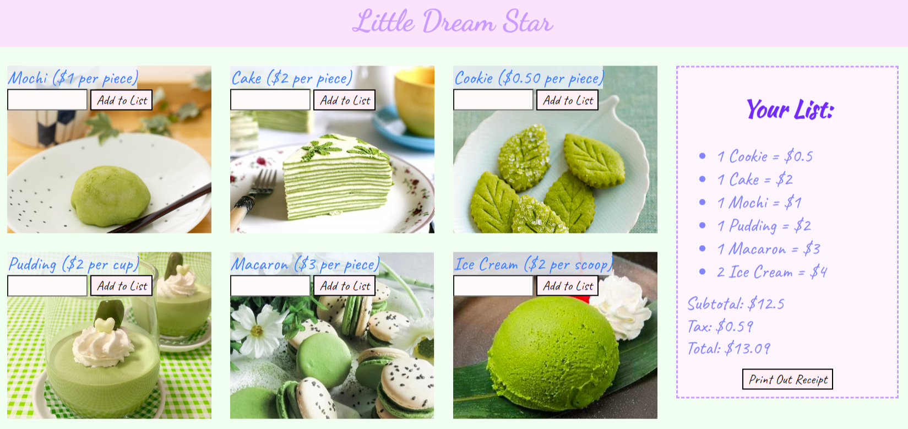
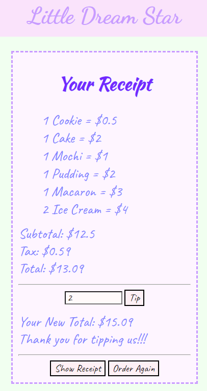

## Design of the project

Little Dream Star is the name of my project that uses the Document Object Model (DOM), a programming interface for web documents. In this project, the user can enter the amount of orders they want in the input box and click the button to add to the list. The list will calculate the subtotal, tax, and total cost of the user’s order. The user can click the “Print Out Receipt” button to see their receipt on the next page. In the receipt, the user can see their receipt and tip. There is also another button called “Order Again” where the user can go back to the home page and order again. The image below shows how the receipt page looks like: 



In the CSS file, there are so many lines of code (a little bit more than 100 lines). I took a lot of time thinking about the design of the website. I have to think about the color, position, background-image, margin, padding, border-style, text-align, font-family, font-size, width, and so much more. 

The front end looks pretty simple and nice to me, but the back end looks a little bit more complicated. In the JavaScript file, I have an item list that keeps track of the name of my menu items and the prices. I also have an order array to keep track of the user's order. I also have many functions to do the calculations. Here is a code example of addMochi function:

```
function addMochi()
{
  var quantity = parseInt(gid('quantity0').value);
  gid('quantity0').value = "";
  if(quantity > 0)
  {
    var cost = quantity + " " + item[0].name + " = $" + item[0].price * quantity;
    var list = document.createElement('li');
    var tn = document.createTextNode(cost);
    list.appendChild(tn);
    var pos = gtn('ul')[0];
    pos.appendChild(list);
    order.push(cost);
    localStorage.setItem("Orders", order);
    subtotal += quantity * item[0].price;
    gid('subtotal').innerHTML = "Subtotal: $" + subtotal;
    gid('tax').innerHTML = "Tax: $" + taxes(subtotal);
    gid('total').innerHTML = "Total: $" + total(subtotal);
  }
}

```

## My Role

This is an individual project that was done by myself.

## My experience

My understanding in DOM became better while doing this project. I learned how to return a function with another function. For example, calling document.getElementsByTagName(e) everytime we use is long. I learned how to shorten this call. I can just make another function with a sorter name and return document.getElementsByTagName(e). Here is the code example: 

```
function gtn(e)
{
  return document.getElementsByTagName(e);
}
```

I also learned that data does not save between websites, so I learned to use local storage in JavaScript. Local storage allows developers to store and retrieve data in the browser. The data stored in local storage will not expire. This means the data will persist even if the tab or the browser window is closed.
