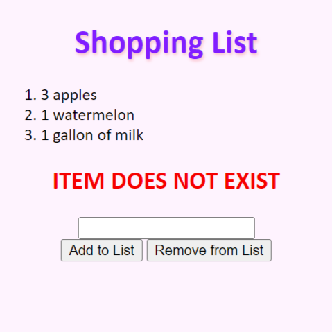
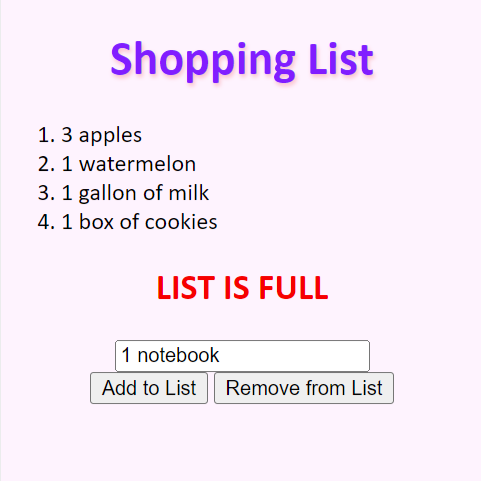

  
  

## Information about the project

Shopping List project is a simple project that uses CSS, HTML, and JavaScript. 

## My Role

This is an individual project that was done by me!

## My experience

I blahblabhjdifjisjf

Each project page should contain at least 2-3 paragraphs of description, along with links to further information about the project. You will want to discuss what you contributed to the project (if the project involved multiple people) as well as what you learned (about software development, team communication, leadership, etc.)

Appropriate description: Your project description should provide at least 3 paragraphs that describe: (1) what the project was about; (2) what your role was and how much of the work you were responsible for; and (3) what did you learn from the experience?