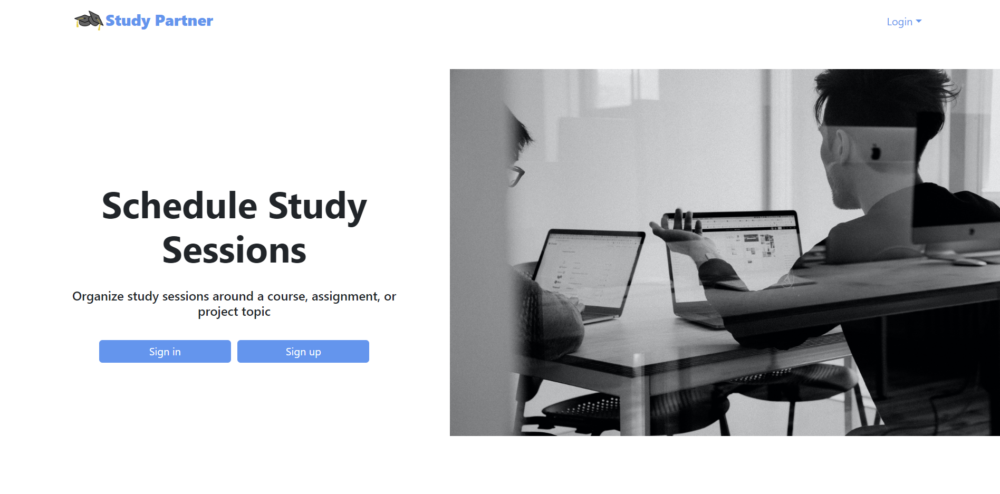
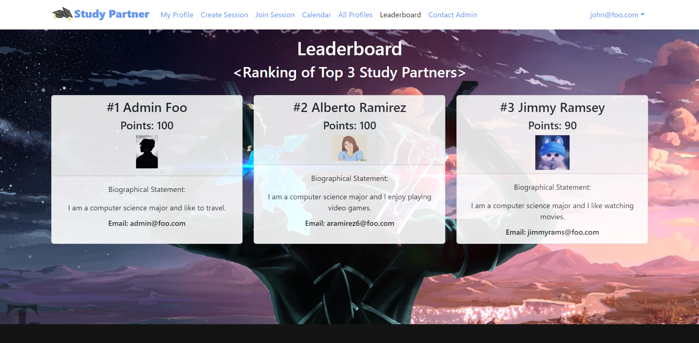
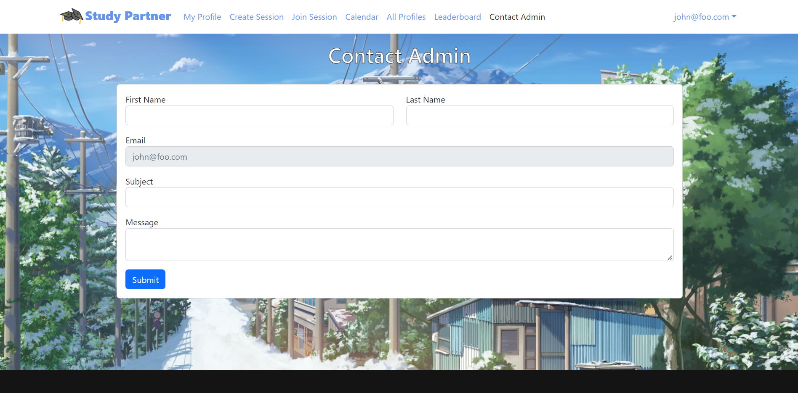
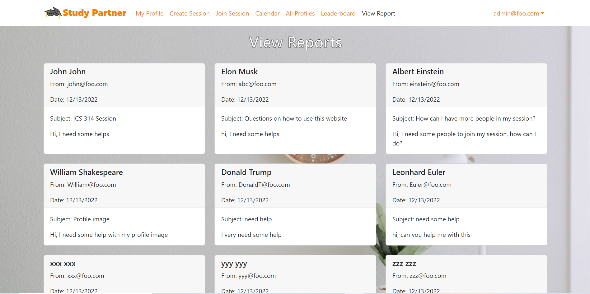

## Design of the project

Many ICS students often spend more time than they need on their homework or course materials because they are working alone and struggling alone without asking for help. Our group implemented a web application called “Study Partner” to solve this problem. Study Partner is an application for ICS students to schedule face-to-face study sessions in ICSpace.

## My Role

One of my contributions to this project is the point system and Leaderboard page (shown below). In the Leaderboard page, users are able to see the top three students who accumulated the most points. Each user starts off with zero points when they sign up for our program. Users are able to earn ten points each time they schedule a study session from the Create Session page or attend a study session from the Join Session page.

Another of my contributions to this project is interaction between users and admins. If users feel that others are engaging in inappropriate behavior, they are able to contact an admin from the Contact Admin page (shown below). To contact admin, users have to fill out a form with their information and the content of the report.

Once the user submits the form, the admin is able to view the report from the View Report page (shown below). Each report is in the form of a card that contains information such as the reporter's name, email, date when filed, and the content of the report.

## My experience

From this project, I got to experience working on a group project. I learned to ask for help when needed. For most parts of the project, I tried to work on my tasks alone even when I got stuck. I realized that instead of struggling alone, I learned to ask my teammates for help. I’m glad to have great teammates who are willing to help me out. I learned that if I am stuck, I really should ask others for help because we want to complete the project together.

During this project, I also experienced some small issues in my group. I think that before we merge our branches to main, we should always run “meteor npm run lint” to check for lint errors in our branches. Some lint errors are easy to fix, but some are not. I am not hundred percent sure on how exactly your code works, so if I fixed the lint error by editing your code, what if the code that I edit changes the result that you wanted? For example, I fixed the lint error by deleting a few lines of your code and it causes the page to be broken because you actually need those lines to make your page functional. I hope to avoid this situation.

If you are interested in learning more about this project, then check out our project’s [“github.io page”](https://study-partner.github.io/). This page contains more detailed information about this project. 
