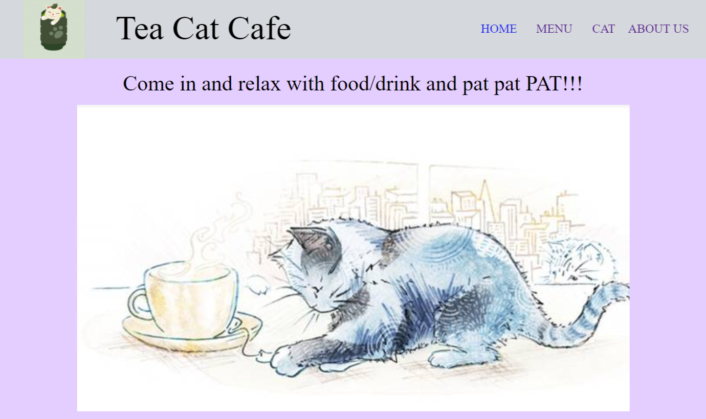
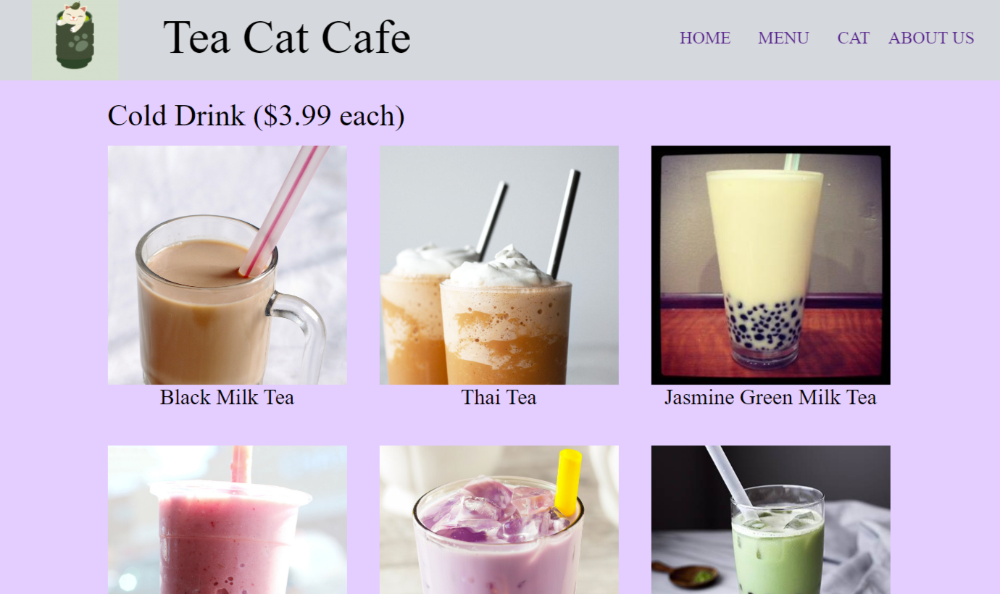
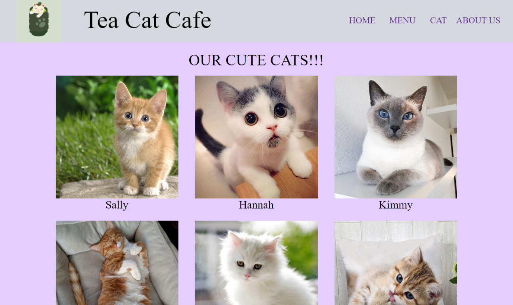
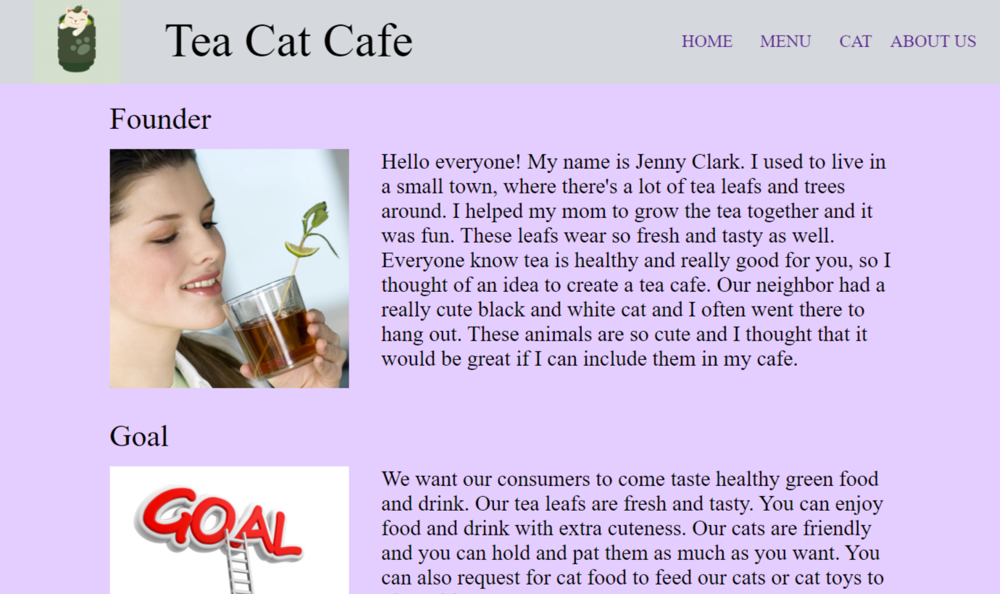

## Design of the project

Tea Cat Cafe is the name of my simple website project. I spent a lot of time designing how the website should look and where to position my div boxes. The div boxes are the HTML division tag, a special element that lets you group similar sets of content together on a web page. Here is a part of my code that shows that I have a lot of div boxes in the HTML file for home page:

```
<div id="top">
  <div id="logo"></div>
  <div id="title">Tea Cat Cafe</div>
  <a href="home.html"><div id="home">HOME</div></a>
  <a href="menu.html"><div id="menu">MENU</div></a>
  <a href="cat.html"><div id="cat">CAT</div></a>
  <a href="about.html"><div id="about">ABOUT US</div></a>
</div>
    
<div id="slogan">Come in and relax with food/drink and pat pat PAT!!!</div>
    
<div id="front"></div>
   
<div class="heading">Most Popular Items</div>
    
<div class="box">
  <div class="item1">
    <div id="img1" class="image"></div>
    <div class="descrip">Taro Milk Tea</div>
  </div>
  <div class="item2">
    <div id="img2" class="image"></div>
    <div class="descrip">Green Tea</div>
  </div>
  <div class="item3">
    <div id="img3" class="image"></div>
    <div class="descrip">Pudding</div>
  </div>
</div>
    
<div class="heading">Cat of the Month: Jenny</div>
   
<div id="cat6"></div>
    
<div id="bottom">
  <p>Address: 415 Kapahulu Ave, Honolulu, HI 96815   /   Phone: (808)-1212-3434  /     Email: teacatcafe@gamil.com</p>
</div>
```

In the CSS file, I have to spend a lot of time designing my div boxes. I have to think about the distance between the div boxes and size of div boxes. I have to think about the position of the div boxes (margins, fixed position, etc.).

The image below shows the Home page.



The image below shows the Menu page.



The image below shows the Cat page.



The image below shows the About Us page.



## My Role

This is an individual project that was done by myself.

## My experience

Some people might think that designing something is easy. However, while doing this project, designing is something that really requires a lot of time and effort. For this project, there were four HTML files corresponding to each page that I showed above. Designing these pages made me feel crazy. In each page, I have a lot of div boxes. I have to keep track of these div boxes which made me realize that naming is very important. If you don’t keep track of your names (id and classes of the div boxes), you will have a hard time looking for the div box you need.
